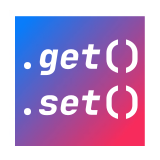

# Generate All Getter And Setter

Generate All Getter And Setter is an IntelliJ IDEA plugin that generates all getter and setter methods for POJO
use [postfix completion](https://www.jetbrains.com/help/idea/settings-postfix-completion.html) like
<kbd>.var</kbd>.

[comment]: <> (<!-- Plugin description -->)

[comment]: <> (This Fancy IntelliJ Platform Plugin is going to be your implementation of the brilliant ideas that you have.)

[comment]: <> (This specific section is a source for the [plugin.xml]&#40;/src/main/resources/META-INF/plugin.xml&#41; file which will be extracted by the [Gradle]&#40;/build.gradle.kts&#41; during the build process.)

[comment]: <> (To keep everything working, do not remove `<!-- ... -->` sections. )

[comment]: <> (<!-- Plugin description end -->)

## Installation

- Using IDE built-in plugin system:

  <kbd>Settings/Preferences</kbd> > <kbd>Plugins</kbd> > <kbd>Marketplace</kbd> > <kbd>Search for "Generate All Getter And Setter"</kbd> >
  <kbd>Install Plugin</kbd>

- Manually:

  Download the [latest release](https://github.com/LiLittleCat/intellij-generate-all-getter-and-setter/releases/latest)
  and install it manually using
  <kbd>Settings/Preferences</kbd> > <kbd>Plugins</kbd> > <kbd>⚙️</kbd> > <kbd>Install plugin from disk...</kbd>

---
Plugin based on the [IntelliJ Platform Plugin Template][template].
## Usage

- Use <kbd>.allget</kbd> to generate all getter methods for POJO.

- Use <kbd>.allset</kbd> to generate all setter methods without default value for POJO.

- Use <kbd>.allsetv</kbd> to generate all setter methods with default value for POJO.

## Special Thanks

- Thanks to [XiaoYao][XiaoYao's link] for helping design the plugin icon.

[XiaoYao's link]: https://space.bilibili.com/15765234

[template]: https://github.com/JetBrains/intellij-platform-plugin-template

## Template ToDo list

- [x] Create a new [IntelliJ Platform Plugin Template][template] project.
- [X] Get familiar with the [template documentation][template].
- [x] Verify the [pluginGroup](/gradle.properties), [plugin ID](/src/main/resources/META-INF/plugin.xml)
  and [sources package](/src/main/kotlin).
- [x] Review the [Legal Agreements](https://plugins.jetbrains.com/docs/marketplace/legal-agreements.html).
- [ ] [Publish a plugin manually](https://plugins.jetbrains.com/docs/intellij/publishing-plugin.html?from=IJPluginTemplate)
  for the first time.
- [x] Set the Plugin ID in the above README badges.
- [ ] Set the [Deployment Token](https://plugins.jetbrains.com/docs/marketplace/plugin-upload.html).
- [ ] Click the <kbd>Watch</kbd> button on the top of the [IntelliJ Platform Plugin Template][template] to be notified
  about releases containing new features and fixes.

